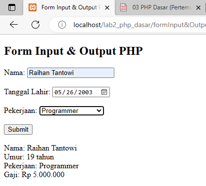

# Lab2Web


# Tugas Praktikum 2 - Lab2Web
## Pemrograman Web 2

```sh
Nama   : Raihan Tantowi
Nim    : 312110229
Matkul : Pemrograman Web 2
```
#### Berikut adalah form input & output dari php 
* **File formInput&Output.php :**
```php
<!DOCTYPE html>
<html>
<head>
	<title>Form Input & Output PHP</title>
</head>
<body>
	<h2>Form Input & Output PHP</h2>
	<form method="POST" action="">
		<label for="nama">Nama:</label>
		<input type="text" name="nama"><br><br>
		<label for="tgl_lahir">Tanggal Lahir:</label>
		<input type="date" name="tgl_lahir"><br><br>
		<label for="pekerjaan">Pekerjaan:</label>
		<select name="pekerjaan">
			<option value="">--Pilih Pekerjaan--</option>
			<option value="Polisi">Polisi</option>
			<option value="Programmer">Programmer</option>
			<option value="Guru">Guru</option>
		</select><br><br>
		<input type="submit" name="submit" value="Submit">
	</form>
	<br>
	<?php
		if(isset($_POST['submit'])){
			$nama = $_POST['nama'];
			$tgl_lahir = $_POST['tgl_lahir'];
			$pekerjaan = $_POST['pekerjaan'];
			
			// Menghitung umur berdasarkan tanggal lahir
			$umur = date_diff(date_create($tgl_lahir), date_create('now'))->y;
			
			// Menentukan gaji berdasarkan pekerjaan
			switch($pekerjaan){
				case 'Polisi':
					$gaji = 8000000;
					break;
				case 'Programmer':
					$gaji = 5000000;
					break;
				case 'Guru':
					$gaji = 4000000;
					break;
				default:
					$gaji = 0;
			}
			
			// Menampilkan hasil output
			echo "Nama: ".$nama."<br>";
			echo "Umur: ".$umur." tahun<br>";
			echo "Pekerjaan: ".$pekerjaan."<br>";
			echo "Gaji: Rp ".number_format($gaji,0,",",".")."<br>";
		}
	?>
</body>
</html>
```

* **Berikut adalah hasil dari form input & output yang telah dibuat :**



